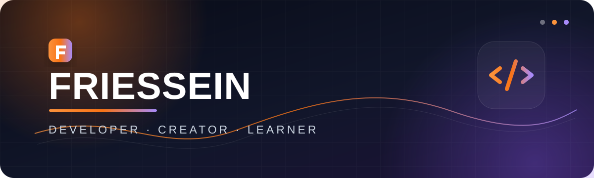

  

<h1 align="center">Hi, I'm Friessein 👋</h1>

  <strong>Developer · Creator · Lifelong learner</strong>

  I enjoy turning ideas into useful experiences, solving problems with code, 
  and learning something new with every project.

  
  

## A little about me

- 💡 I like building thoughtful, useful things.
- 🧩 I enjoy breaking complex problems into clear, manageable pieces.
- 🌱 I am always experimenting, learning, and improving my craft.
- 🤝 I value clean collaboration and ideas that make a real difference.

## Toolbox

  

  
<strong>Toolbox, in words</strong>

   
  JavaScript · TypeScript · Python · React · Node.js · Tailwind CSS · PostgreSQL · MongoDB · Docker · Git · Linux · Figma

## GitHub activity

  <picture>
    <source media="(prefers-color-scheme: dark)" srcset="https://github-readme-activity-graph.vercel.app/graph?username=Friessein&amp;bg_color=0B1020&amp;color=E5E7EB&amp;line=F97316&amp;point=A78BFA&amp;area=true&amp;area_color=7C3AED&amp;hide_border=true&amp;custom_title=Contribution%20activity" />
    <source media="(prefers-color-scheme: light)" srcset="https://github-readme-activity-graph.vercel.app/graph?username=Friessein&amp;bg_color=FFFFFF&amp;color=374151&amp;line=EA580C&amp;point=7C3AED&amp;area=true&amp;area_color=DDD6FE&amp;hide_border=true&amp;custom_title=Contribution%20activity" />
    
  </picture>

  

---

  <em>Thanks for stopping by. Keep building, keep learning.</em>

